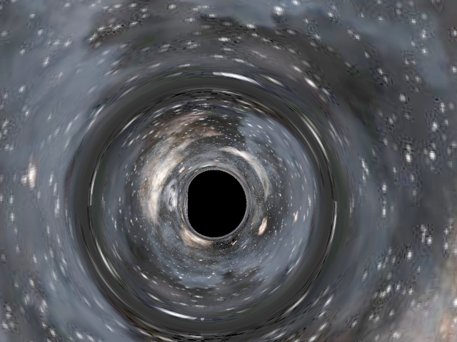

left image **prender**  
[right image reference original](https://kagamin.net/hole/edupt/) 

---

## prender examples

right image  
https://www.pbrt.org/scenes-v2  
sanmiguel.pbrt: this scene was modeled by Guillermo M. Leal Llaguno of Evolución Visual, based on a hacienda that he visited in San Miguel de Allende, Mexico. The scene was modeled in 3ds max and exported to the pbrt file format with a custom script written by Guillermo. The scene features just over 2.5 million unique triangles and has a total geometric complexity of 10.7 million triangles due to the use of object instancing; the pbrt files that describe the scene geometry require 620 MB of on-disk storage. There are a total of 354 texture maps, representing 293 MB of texture data.

---
## participating media

  

### Isotropic scattering  
  

### Forward scattering  
  

### Backscatter  

## Subsurface Scattering  
### BSSRDF
  

### Scattering simulation

---

# **Gravitational Renderer**  

## **Black hole**

  

  

right image 
© 2014 Warner Bros. Entertainment, Inc. and Paramount Pictures. All Rights Reserved  
Double Negative Gravitational Renderer

right image 
© 2014 Warner Bros. Entertainment, Inc. and Paramount Pictures. All Rights Reserved  
Double Negative Gravitational Renderer
The image on the left shows the Glow effect added to the prender output.
https://hp.vector.co.jp/authors/VA014310/pika_13s.lzh

right image 
© 2014 Warner Bros. Entertainment, Inc. and Paramount Pictures. All Rights Reserved  
Double Negative Gravitational Renderer 
The image on the left shows the Glow effect added to the prender output.
https://hp.vector.co.jp/authors/VA014310/pika_13s.lzh

## Inspired by the movie Interstellar.  

## Differences in appearance of Kerr black holes due to differences in angular momentum  

## **Wormhole**

  

[Visualizing Interstellar's Wormhole](https://arxiv.org/abs/1502.03809)  
A7a -- A7e

  

Notes.  
This is an example of two different scenes connected by a wormhole.

---

Notes.  
There is a scene in the movie in which the main character Cooper looks at the wormhole and says, “It is different from the picture I saw,” and Dr. Romilly explains that it is a spherical hole because it is a three-dimensional hole. Many people find it difficult to understand the meaning of this spherical hole, but now that the wormhole has been rendered, it is easier to understand if you change your viewpoint and go around the wormhole as shown in the figure.
It is indeed a spherical hole.  

---
# Black holes and wormholes in the Cornell Box  

## Black hole in the Cornell box  

## Wormhole in the Cornell Box 
  

Notes.  
This is an example of two cornell boxes connected by a wormhole. One of the cornell boxes is placed quite far away from the other.

  
  
---
# movie

[black hole Simulation movie](https://youtu.be/YJnTv-6gkeA)  

[Wormhole Simulation movie](https://www.youtube.com/watch?v=jZFnY222hNY)  
[Wormhole Simulation movie](https://youtu.be/Jasjg_Liy88)  
[Wormhole Simulation movie](https://youtu.be/EVsvn2w-R5M)  
[Wormhole Simulation movie](https://youtu.be/-JJsPU5Bamk)  

